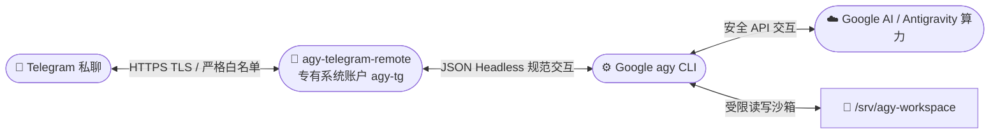

<div align="center">

# 🤖 Antigravity Telegram Remote

**把 Telegram 私聊打造为你专属的 Google Antigravity CLI (`agy`) 远程云端交互终端**

[](https://github.com/shixiaoheia/agy-telegram-remote/actions/workflows/tests.yml)
[](https://www.python.org/)
[](#-零第三方依赖)
[](https://t.me/xiaoheidemimi)
[](https://bandwagonhost.com/aff.php?aff=80815)

[✨ 核心亮点](#-核心亮点) • [⚡ 极简安装](#-极简三步安装) • [🎮 使用指南](#-使用指南与指令速查) • [🧠 官方模型切换](#-官方全量模型支持与快捷别名-model) • [⚙️ 目录与配置](#-目录与配置说明) • [❓ 常见排错](#-常见问题排查-faq)

</div>

---

> 📢 **官方交流社区**：加入 Telegram 频道 **[Xiaohei的秘密基地](https://t.me/xiaoheidemimi)**，实时获取最新版本发布、使用技巧与答疑交流！<br>
> 🚀 **推荐服务器**：建站与稳定运行 VPS 首选推荐 **[搬瓦工 BandwagonHost（专属优惠通道）](https://bandwagonhost.com/aff.php?aff=80815)**。

---

## 📖 项目简介

**Antigravity Telegram Remote** 能够将 Telegram 私聊转变为你在 Linux 服务器上调用 **Google Antigravity CLI (`agy`)** 的安全控制入口。

只需向 Telegram 机器人发送自然语言指令，程序便会在服务器的隔离工作目录中调用 `agy`，执行代码重构、环境分析、脚本编写与运维调试，并将结构化结果实时回传给你的 Telegram。

### 🔄 架构与工作流



### 💬 交互效果演示

```text
👤 你：
/model

🤖 Antigravity Remote：
🧠 模型选择与切换 ｜ 当前：gemini-3.8-flash-high
━━━━━━━━━━━━━━━━━━━━
请在下方直接点击按钮一键切换模型，或发送 /model <别名>
...
[ 🔘 3.8 Flash High ] [ ⚪ 3.8 Medium ]
[ ⚪ 3.1 Pro High   ] [ ⚪ Sonnet 4.6 ]

👤 你：
请分析当前目录下的 Python 文件结构并给出性能优化建议

🤖 Antigravity Remote：
⏳ 任务分派成功 ｜ task-cd878c3f
━━━━━━━━━━━━━━━━━━━━
• 🤖 调用模型：gemini-3.8-flash-high
• 🧠 上下文：全新独立会话
• 📁 工作目录：/srv/agy-workspace
━━━━━━━━━━━━━━━━━━━━
正在受控沙箱中执行，请稍候...

🤖 Antigravity Remote：
✅ 任务执行完毕 ｜ ⏱️ 12.4s ｜ gemini-3.8-flash-high
━━━━━━━━━━━━━━━━━━━━
【分析报告摘要】
1. 已扫描完成当前工作目录下的 6 个核心模块；
2. 发现 2 处潜在边界条件需补充异常捕获；
3. 建议使用生成器优化数据流式处理，可降低约 35% 内存峰值占用。
━━━━━━━━━━━━━━━━━━━━
• 📈 Token 消耗：输入 1,234 ｜ 输出 567 ｜ 总计 1,801
• 🧠 会话轮次：第 1 轮
• 🆔 任务标识：task-cd878c3f
```

---

## ✨ 核心亮点

- 🎨 **Antigravity 拟物风卡片与友好 Emoji 体验**：
  - 任务接收与结果回传全面升级为卡片式排版、双分割线与动态状态徽标；
  - 告别生硬的命令行报错，提供自然优雅的交互感知。
- 🔘 **Telegram 行内按钮一键直切模型与引擎调优（Inline Keyboard）**：
  - 发送 `/model`、`/effort`、`/mode` 弹出交互式按钮面板，手指轻点即刻切换模型、思考深度（low/med/high）与模式（plan/code）；
  - 切换即时弹出顶部 Toast 气泡反馈，同时保留文本别名输入习惯。
- 🧠 **连续对话与多轮记忆能力（Context Continuity）**：
  - 自动维护并持久化用户会话，底层注入 `agy --conversation <id>` 保持多轮上下文；
  - 支持 `/new` / `/reset` 一键遗忘并开启全新任务会话。
- 📈 **精准 Token 统计与 `/usage` 报表**：
  - 每次任务执行完毕即时解析 Google agy 实际回传的 Token 消耗（输入/输出/思考/总计）；
  - 提供 `/usage` 专属报表，一目了然掌握当前会话及历史累计资源消耗。
- 🖥️ **零依赖 Linux 系统监控与工作区浏览（`/sys` & `/ls`）**：
  - `/sys`（或 `/system`）：直接读取系统 `/proc`，即时汇报 VPS 负载、物理内存、磁盘占用与 Bot 进程常驻内存（RSS）；
  - `/ls`（或 `/files`）：即时查看工作区最近修改的文件列表、大小与时间，内置严密路径防穿越拦截。
- 👥 **动态白名单管理与安全热重载（`/whitelist` & `/restart`）**：
  - 管理员可在私聊中直接使用 `/whitelist add/remove` 动态增删白名单用户，无需修改配置文件；
  - 管理员专用 `/restart` 命令支持平滑就地热重载（仅在任务空闲时放行），零停机加载最新代码与环境。
- 👑 **支持单机 VPS 极简 Root 运行模式（`--root`）**：
  - 既支持生产级最小权限专有账户 `agy-tg` 沙箱，也支持使用 `--root` 参数直接以 root 账户运行；
  - 专为个人 VPS（如无多用户需求的独立主机）提供最省心的免折腾体验。
- 🛡️ **严格安全边界与权限沙箱**：
  - **白名单机制**：严格拒绝群聊，仅允许预设数字 ID 的白名单私聊用户访问；
  - **符号链接防护与防穿越**：工作目录与状态文件均开启强制正则检查与符号链接拦截。
- ⚡ **零第三方依赖**：
  - 纯 Python 3.10+ 标准库（`asyncio` / `urllib.request` / `subprocess` / `json` 等）精心打造；
  - 无需 `pip` 安装，不依赖虚拟环境、Redis 或外部数据库，系统轻盈无负担。
- 🚦 **高可靠消息引擎与控制解耦**：
  - 引入有界异步队列解耦任务与控制通道，长任务执行期间 `/cancel`、`/status` 秒级响应，彻底杜绝网络卡顿引发的假死；
  - 启动阶段内置网络退避重试，优雅吸收突发 429 或瞬态网络抖动。
- 📦 **极简三步交互式部署向导**：
  - 自带交互式管理菜单（安装/更新、卸载、退出）；
  - 极简三步走：`Bot Token` → `Telegram 数字 ID` → `Google 授权`，自动配置 systemd 守护进程。

---

## 🖥️ 环境要求

- **操作系统**：Debian 12+ 或 Ubuntu 22.04+
- **系统特权**：具备 systemd 环境、拥有 root 或 sudo 管理权限
- **网络条件**：能够正常访问 GitHub、Google 与 Telegram Bot API 网络
- **准备清单**：
  1. Telegram Bot Token（向官方 [@BotFather](https://t.me/BotFather) 申请）
  2. 你的 Telegram 数字用户 ID（向 [@userinfobot](https://t.me/userinfobot) 获取）
  3. 可用于 Google 授权登录的账号与浏览器

> [!NOTE]
> 社区开源项目，与 Google、Telegram 官方无隶属关联。请仅部署到你拥有所有权或获得授权的服务器与 Bot。

---

## ⚡ 极简三步安装

在具备 root 或 sudo 权限的 SSH 终端中执行以下命令（**先下载脚本，再用 bash 交互运行**）：

```bash
curl -fsSLO https://raw.githubusercontent.com/shixiaoheia/agy-telegram-remote/main/install.sh
bash install.sh
```

> [!TIP]
> **为什么不建议 `curl ... | bash`？**
> 本项目向导需要在终端中安全接收隐藏输入的 Bot Token 与数字 ID，先下载后运行能确保最佳的交互体验与安全审阅。

### 📋 安装向导流程一览

运行 `bash install.sh` 后将首先显示**管理菜单**：

```text
=============================================
 Antigravity Telegram Remote 管理菜单
=============================================
  1) 安装 / 更新
  2) 卸载
  0) 退出

请输入选项 [0/1/2]：1
```

选择 `1` 进入三步极简安装向导：

```text
=============================================
 Antigravity Telegram Remote 极简一键安装向导
=============================================

步骤 1/3：请输入 Telegram Bot Token：
> （密码模式输入隐藏，保障凭据安全）

步骤 2/3：请输入 Telegram 数字 ID：
> 123456789

自动准备运行账户、/srv/agy-workspace、系统依赖与 Google agy……

步骤 3/3：Google 账号授权
- 若已有历史有效授权，将自动识别并复用；
- 首次授权请打开终端显示的授权链接 → 浏览器登录 → 粘贴授权码；
- 进入 agy 终端主界面后输入 /exit 即可返回安装器。

正在验证 agy 回复、Telegram 接口及服务自检……

🎉 安装成功！后台守护服务已启动就绪。
```

> [!TIP]
> **平滑升级**：后续版本更新时，直接重新执行 `bash install.sh` 并选 `1`，步骤 1 和步骤 2 直接按回车即可完整保留原有的 Token、白名单与运行配置，平滑无缝升级！详见 [管理菜单说明文档](docs/INSTALL_MENU.md)。

> [!TIP]
> **👑 个人独立 VPS 的 Root 极简模式**：
> 如果你的 VPS 为个人独享主机（无需多用户沙箱隔离），推荐使用 `--root` 参数一键部署：
> ```bash
> bash install.sh --root
> ```
> 守护进程将直接以 root 身份运行于 `/root` 环境，免除多系统用户切换与权限隔离的繁琐配置。

---

## 🔍 安装后验证

安装成功后，可通过 systemd 状态指令核验后台守护进程：

```bash
# 查看服务实时运行状态
sudo systemctl status agy-telegram-remote --no-pager

# 查看最近服务日志
sudo journalctl -u agy-telegram-remote -n 80 --no-pager
```

### 🤖 私聊 Bot 自检三步曲

打开 Telegram 私聊刚刚绑定的机器人，依次发送：

1. `/start`：验证机器人是否在线，返回欢迎界面与命令说明；
2. 发送测试任务：`只回复“连接成功”，不要使用工具或修改任何文件。`，验证基础执行流程与结果回传；
3. `/last`：取回上一条任务保存的完整结果，验证状态持久化与本地存储。

---

## 🎮 使用指南与指令速查

在与 Bot 的私聊中，支持以下全部指令：

| 快捷指令 | 功能分类 | 详细行为说明 |
| :--- | :--- | :--- |
| 💬 **直接发送文本** | 发送任务 | 在工作目录调用 agy 执行任务，自动继承当前会话上下文记忆（多轮连续对话） |
| 🧠 `/model` | 模型管理 | 呼出 Telegram 行内按钮一键直切模型，或通过别名切换官方 14 种模型 |
| ⚡ `/effort` | 思考深度 | 调节任务推理思考深度（`low` / `medium` / `high` / `default`） |
| 📋 `/mode` | 执行模式 | 切换 agy 执行行为模式（`plan` 只推演不改文件 / `code` 自动生成代码） |
| 🆕 `/new` 或 `/reset` | 会话重置 | 清空当前对话上下文记忆，开启全新的独立任务会话 |
| 📈 `/usage` | 用量统计 | 查看当前会话轮次进度与历史累计 Token 消耗明细（输入/输出/思考/总计） |
| 📊 `/status` | 状态监控 | 查看任务运行状态、生效模型/思考/模式、活动会话、进程常驻内存与磁盘空间 |
| 🖥️ `/sys` | 系统监控 | 实时查看 VPS 负载、CPU 核心、物理内存、磁盘、Bot PID 与常驻内存 |
| 📂 `/ls` 或 `/files` | 目录浏览 | 查看工作目录最近修改的文件列表、大小与时间（支持指定相对子路径） |
| 👥 `/whitelist` | 白名单管理 | 动态授权/撤销使用用户（`/whitelist add <id>`、`/whitelist remove <id>`） |
| 🔄 `/restart` | 安全重载 | 管理员热重启 Bot 服务进程（任务空闲时即刻重新加载环境与代码） |
| 🛑 `/cancel` | 应急中止 | 立即请求中断正在执行的自身任务，并安全回收下属全部进程组 |
| 📜 `/last` | 结果回溯 | 重新获取上一次任务执行完成的完整结果（仅读取本地持久化，不消耗算力） |
| 🆔 `/id` | 身份识别 | 在私聊中显示当前账号的 Telegram 数字 ID（内置 2 秒防刷限频） |
| ❓ `/help` | 帮助信息 | 随时呼出命令提示与操作指南 |

---

## 🧠 官方全量模型支持与快捷别名（`/model`）

机器人深度适配了 Google Antigravity CLI 官方全量 14 种 AI 模型，支持按需随时一键切换，并提供人性化快捷别名：

| 类别 / 家族 | 官方模型标识符 | 推荐快捷别名 | 特点与适用场景 |
| :--- | :--- | :--- | :--- |
| 🚀 **Gemini 3.8 Flash** | `gemini-3.8-flash-high` | `3.8` / `3.8-high` / `flash` | 🔥 **官方推荐**，超高思考等级，综合性能强悍 |
| | `gemini-3.8-flash-medium` | `3.8-med` | 中等思考强度，平衡速度与深度 |
| | `gemini-3.8-flash-low` | `3.8-low` | 低思考强度，极速响应简单指令 |
| ⚡ **Gemini 3.7 Flash** | `gemini-3.7-flash-high` | `3.7` / `3.7-high` | 经典高效思考模型（高思考） |
| | `gemini-3.7-flash-medium` | `3.7-med` | 适度思考（中思考） |
| | `gemini-3.7-flash-low` | `3.7-low` | 快速返回（轻度思考） |
| 💡 **Gemini 3.6 Flash** | `gemini-3.6-flash-high` | `3.6` / `3.6-high` | 轻量化推理（高思考） |
| | `gemini-3.6-flash-medium` | `3.6-med` | 基础日常辅助（中思考） |
| | `gemini-3.6-flash-low` | `3.6-low` | 纯指令直接处理（低思考） |
| 🧠 **Gemini 3.1 Pro** | `gemini-3.1-pro-high` | `pro` / `3.1` / `pro-high` | 🎯 **深度推理旗舰**，适合复杂重构与架构设计 |
| | `gemini-3.1-pro-low` | `pro-low` | 快速专业推理 |
| 🎭 **Anthropic Claude** | `claude-sonnet-4-6` | `sonnet` | Claude Sonnet 4.6 深度思考与精准编码 |
| | `claude-opus-4-6-thinking` | `opus` | Claude Opus 4.6 顶级旗舰思考模型 |
| 🌐 **开源顶级基座** | `gpt-oss-120b-medium` | `gpt` / `120b` | 1200 亿参数开源大模型基座 |

### 💡 `/model` 常用操作示例

- **交互式点击切换**：直接发送 `/model`，在弹出的 Telegram 行内键盘上直接点击目标模型按钮即可瞬间切换，并有顶部 Toast 提示。
- **快捷别名切换**：
  - 切换到 Gemini 3.8 高思考版：`/model 3.8` 或 `/model flash`
  - 切换到 Gemini 3.1 Pro 旗舰版：`/model pro`
  - 切换到 Claude Sonnet：`/model sonnet`
  - 切换到 Claude Opus 思考版：`/model opus`
  - 切换到开源 120B：`/model 120b`
- **重置为系统默认**：`/model default`（或在按钮面板点击「恢复默认」）
- **自由扩展**：未来若官方上线新模型（如 `gemini-4.0-flash`），可直接输入 `/model <新模型名>` 进行直连透传！

---

## ⚡ 思考深度与执行模式调优（`/effort` 与 `/mode`）

通过指令或行内按钮微调底层 `agy` CLI 推理行为：

- **思考深度控制（`/effort`）**：
  - 发送 `/effort`：弹出 `[🟢 low] [🟡 medium] [🔴 high] [⚪ default]` 行内按钮一键调节；
  - 也可以直接发送指令：`/effort low`、`/effort medium`、`/effort high` 或 `/effort default`；
  - 设置后后续所有任务均自动携带对应 `--effort` 参数，兼顾推理速度与思考质量。
- **执行模式控制（`/mode`）**：
  - 发送 `/mode`：弹出 `[📐 plan] [💻 code] [⚪ default]` 行内按钮一键切换；
  - `/mode plan`：仅架构分析与推理规划，**不修改任何工作区文件**（只读推演安全模式）；
  - `/mode code`（或 `accept-edits`）：代码生成与修改模式，允许直接落盘编辑；
  - `/mode default`：恢复默认交互模式。

---

## 🖥️ 运维管理与系统监控（`/sys`、`/ls`、`/whitelist`、`/restart`）

专为无头 Linux VPS 打造的一站式运维与控制指令：

- **实时硬件与进程监控（`/sys` 或 `/system`）**：
  - 直接读取 Linux `/proc` 接口（纯标准库，零外部包），秒级回传：
    - 🖥️ **系统平台与版本**（如 Debian 12 / x86_64）；
    - ⏱️ **主机运行时间**（Uptime 天数/小时/分钟）；
    - 📊 **系统负载（Loadavg）**（1 分钟 / 5 分钟 / 15 分钟负载及 CPU 核心数）；
    - 🧠 **物理内存**（已用 / 总量 / 可用量与百分比）；
    - 💾 **工作区磁盘**（已用 / 总量 / 剩余可用空间）；
    - 🤖 **Bot 进程监控**（PID、物理常驻内存 RSS MB、Python 版本）。
- **工作区文件快速浏览（`/ls` 或 `/files`）**：
  - `/ls`：列出当前工作目录中最近修改的 15 个文件与子目录，清晰标明文件大小与最后修改时间；
  - `/ls <相对路径>`：浏览指定子目录；
  - 🛡️ **严格安全沙箱**：内置路径规范化，严禁 `..` 目录遍历穿越，自动跳过符号链接与敏感配置文件。
- **动态白名单权限控制（`/whitelist`）**：
  - `/whitelist` 或 `/whitelist list`：查看当前所有被授权的用户 ID（包含静态配置与动态新增）；
  - `/whitelist add <telegram_id>`：管理员在私聊中直接动态授权新用户，即刻生效；
  - `/whitelist remove <telegram_id>`：管理员动态撤销用户授权（基础配置用户受保护，防止误踢自己）。
- **进程热重载（`/restart`）**：
  - 管理员发送 `/restart`，在任务空闲槽位触发平滑就地 `os.execv` 重启；
  - 自动保留所有持久化状态，重载最新 Python 代码与环境，无需登录终端执行 `systemctl restart`。

---

## 📂 目录与配置说明

系统采用标准化生产级目录划分，遵循 Linux Filesystem Hierarchy Standard (FHS)：

| 路径 | 权限模式 | 作用说明 |
| :--- | :--- | :--- |
| `/etc/agy-telegram-remote/config.env` | `root:agy-tg` (0640) | 核心生产配置文件（含 Token、白名单），严禁对外泄露 |
| `/opt/agy-telegram-remote` | `root:root` (0755) | 当前 root 管理的程序发布软链入口 |
| `/opt/agy-telegram-remote-releases/` | `root:root` (0755) | 程序历史与当前版本发布目录 |
| `/srv/agy-workspace` | `agy-tg:agy-tg` (0700) | 核心任务工作目录（所有任务执行时默认以此目录为根） |
| `/home/agy-tg` | `agy-tg:agy-tg` (0700) | `agy-tg` 账户 HOME、agy 核心二进制与 Google 授权凭据目录 |
| `/var/lib/agy-telegram-remote` | `agy-tg:agy-tg` (0700) | 持久化任务结果、每用户模型偏好及轮询水位存储 |
| `/run/lock/agy-telegram-remote-deploy.lock` | `root:root` | 安装、更新、卸载部署排他锁，防止并发操作踩踏 |
| `/var/backups/agy-telegram-remote/` | `root:root` (0700) | root 专有升级备份目录，保障失败时可安全回滚 |

### ⚙️ 修改配置与重载服务

如需调整参数（如白名单列表、任务超时时限等），可直接编辑配置文件：

```bash
# 安全编辑配置文件（受限权限保护）
sudoedit /etc/agy-telegram-remote/config.env

# 重启服务使新配置立即生效
sudo systemctl restart agy-telegram-remote
```

支持的完整配置项与缺省说明可参考 [.env.example](.env.example)。

---

## 🔄 升级、迁移与维护

项目升级极其简便，无需繁琐的人工步骤：

1. **一键智能更新**：
   ```bash
   bash install.sh
   ```
   输入 `1` 进入安装/更新流程。脚本会自动检测已有配置并提示，**在步骤 1 和步骤 2 中直接回车**，将完整保留原有 Token、白名单、工作目录与 Google 登录凭据，并在通过离线测试后平滑就绪。

2. **常用维护选项**：
   - **强制重新登录 Google 授权**：`bash install.sh --reauth`
   - **为旧版升级明确开启自动审批**：`bash install.sh --enable-auto-approve`
   - **指定固定 GitHub Commit SHA 升级**：`bash install.sh --ref <COMMIT_SHA>`

更多详细迁移、回退及备份机制请参阅 [docs/MIGRATION.md](docs/MIGRATION.md)。

---

## 🗑️ 卸载与清理

提供了两种不同安全等级的卸载模式：

```bash
# 模式 A：安全卸载（默认）—— 选择管理菜单 2，或直接执行：
bash install.sh --uninstall
```
> [!NOTE]
> 安全卸载模式下，系统仅停止并移除 systemd 服务单元，**完整保留程序、配置文件、工作目录成果及 Google 授权**，输入 `UNINSTALL` 确认，防止误删重要资产。

```bash
# 模式 B：彻底清理（Purge 模式）
bash install.sh --uninstall --purge
```
> [!CAUTION]
> 彻底清理模式将永久删除代码发布目录、全部配置与任务记录、工作目录、备份文件以及专有运行账户 `agy-tg`。此操作需要额外输入 `PURGE` 二次确认。

---

## ❓ 常见问题排查（FAQ）

<details>
<summary><b>🔴 报错：检测到账户存在多余附加组权限（如 users 组）？</b></summary>

- **原因**：部分 Debian 12 / Ubuntu 系统的默认安全策略会在创建账户时附加 `users` 组，安装器内置的权限合规检查会拦截该行为，以防权限扩散。
- **解决办法**：若管理员确认该账户确为本项目专用，执行以下命令移除非特权附加组即可继续安装：
  ```bash
  sudo gpasswd -d agy-tg users
  ```
</details>

<details>
<summary><b>🔴 报错：Bot Token 检查失败或无法连通？</b></summary>

- **原因**：通常为复制粘贴时携带了空格、换行符，或者服务器无法正常直连 Telegram API 服务器。
- **排查建议**：
  1. 重新从 [@BotFather](https://t.me/BotFather) 完整复制 Token；
  2. 测试服务器能否正常访问 Telegram API：
     ```bash
     curl -I https://api.telegram.org
     ```
</details>

<details>
<summary><b>🔴 提示：检测到当前 Bot 已被配置 Webhook？</b></summary>

- **原因**：本项目采用标准的长轮询（Long Polling）机制，如果之前使用过该 Bot 配置了 Webhook 会发生接口冲突。
- **解决办法**：使用浏览器或 curl 调用一次 Telegram 官方接口删除旧 Webhook：
  ```bash
  curl -s "https://api.telegram.org/bot<你的TOKEN>/deleteWebhook"
  ```
</details>

<details>
<summary><b>🔴 日志出现 Telegram 409 Conflict 冲突？</b></summary>

- **原因**：说明当前有另外一个实例正在使用相同的 Bot Token 进行轮询。
- **解决办法**：检查是否有其他服务器同时启动了该 Bot，或者本地有残留的手工调试进程。确保同一时刻只有一个服务实例使用该 Token。
</details>

<details>
<summary><b>🔴 如何查看详细错误日志与排查？</b></summary>

- 使用 systemd 诊断日志指令快速追踪：
  ```bash
  # 实时追踪运行日志
  sudo journalctl -u agy-telegram-remote -f
  ```
</details>

---

## 🛡️ 安全设计与架构边界

为保证服务器与数据的绝对安全，使用前请了解以下设计边界：

1. **最小权限与多模式选择**：程序默认以专有非特权账户 `agy-tg` 运行后台守护进程，剥离所有非必要附加组和提权能力；单机独享用户亦可按需指定 `--root` 模式极简部署。
2. **工作目录边界与防提权**：建议将 `agy` 限制在专用 VPS 或独立工作目录内。非 root 运行与目录隔离能抵御绝大多数越权，但不等同于内核级绝对容器隔离，请勿将敏感生产数据存放在同一系统内。
3. **白名单防线**：任何未在配置白名单中的 Telegram 用户发送的消息均会被静默丢弃，群聊消息一律直接忽略。
4. **单任务互斥执行**：共享工作目录下同一时刻仅允许运行一个任务，杜绝并发竞争写引发的文件冲突。

更详尽的安全规范与安全审计策略请参阅 [SECURITY.md](SECURITY.md)。

---

## 🧪 开发者与测试验证

本项目包含完备的离线自动化测试套件（含 176 项全面断言测试），覆盖语法、沙箱权限、参数注入防御、状态持久化、会话记忆、Token 用量解析、系统监控、白名单运维与行内键盘切换：

```bash
# 运行离线测试套件（零外部依赖，使用模拟 Telegram 与虚拟 agy）
bash scripts/verify.sh
```

- 测试规范与本地双权限校验详见 [docs/TESTING.md](docs/TESTING.md)。
- GitHub Actions CI 矩阵配置文件位于 [`.github/workflows/tests.yml`](.github/workflows/tests.yml)。

---

## 🤝 致谢与官方参考

- 🌟 本项目最初灵感与原型参考自开源项目 [whypuss/agy-telegram-bot](https://github.com/whypuss/agy-telegram-bot)，向原作者 [@whypuss](https://github.com/whypuss) 致以崇高谢意！
- 📖 [Google agy 官方文档与安装指南](https://antigravity.google/docs/cli/install/)
- 📖 [Google agy Headless 规范与参数参考](https://antigravity.google/docs/cli/headless/)
- 📖 [Telegram Bot API 官方技术文档](https://core.telegram.org/bots/api)

---

<div align="center">

### 🌐 关注与支持

📢 **Telegram 社区**：[Xiaohei的秘密基地](https://t.me/xiaoheidemimi)（欢迎进群交流体验与反馈问题）<br>
🚀 **优质 VPS 推荐**：稳定高速 VPS 推荐使用 [搬瓦工 BandwagonHost（专属推广通道）](https://bandwagonhost.com/aff.php?aff=80815)

⭐ **如果这个项目对你有帮助，欢迎在 GitHub 点亮右上角的小星星 Star 支持一下！** ⭐

</div>
