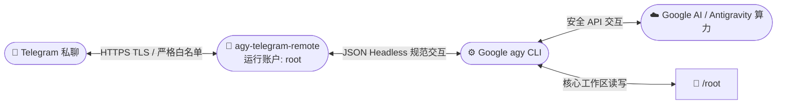

<div align="center">

# 🤖 Antigravity Telegram Remote

**把 Telegram 私聊打造为你专属的 Google Antigravity CLI (`agy`) 远程云端交互终端**

[](https://github.com/shixiaoheia/agy-telegram-remote/actions/workflows/tests.yml)
[](https://www.python.org/)
[](#-零第三方依赖)
[](https://t.me/xiaoheidemimi)
[](https://bandwagonhost.com/aff.php?aff=80815)

[⚡ 极简一键直装](#-极简一键直装复制即用) • [✨ 核心亮点](#-核心亮点) • [🎮 指令速查](#-使用指南与指令速查) • [🧠 模型与调优](#-官方全量模型支持与快捷别名-model) • [💬 会话与用量](#-连续对话与-token-用量统计-new--reset--usage) • [🖥️ 运维与监控](#-运维管理与系统监控-sys-ls-whitelist-restart) • [👑 Root 模式](#-单机-vps-极简-root-部署模式-root) • [⚙️ 目录与配置](#-目录与配置说明) • [❓ 常见排错](#-常见问题排查-faq)

</div>

---

> 📢 **官方交流社区**：加入 Telegram 频道 **[Xiaohei的秘密基地](https://t.me/xiaoheidemimi)**，实时获取最新版本发布、使用技巧与答疑交流！<br>
> 🚀 **推荐服务器**：建站与稳定运行 VPS 首选推荐 **[搬瓦工 BandwagonHost（专属优惠通道）](https://bandwagonhost.com/aff.php?aff=80815)**。

---

## ⚡ 极简一键直装（复制即用）

在 VPS 终端直接复制粘贴运行以下命令：

```bash
curl -fsSL https://raw.githubusercontent.com/shixiaoheia/agy-telegram-remote/main/install.sh -o install.sh && bash install.sh --root
```

---

## 📖 项目简介

**Antigravity Telegram Remote** 能够将 Telegram 私聊转变为你在 Linux 服务器上调用 **Google Antigravity CLI (`agy`)** 的安全控制入口。

只需向 Telegram 机器人发送自然语言指令，程序便会在服务器的隔离工作目录中调用 `agy`，执行代码重构、环境分析、脚本编写与运维调试，并将结构化结果实时回传给你的 Telegram。

### 🔄 架构与工作流



### 💬 交互效果演示

```text
👤 你：
/model

🤖 Antigravity Remote：
🧠 AI 模型管理 ｜ 当前生效模型：gemini-3.8-flash-high
━━━━━━━━━━━━━━━━━━━━
• 切换指令：/model <模型名或别名>
• 恢复默认：/model default
━━━━━━━━━━━━━━━━━━━━
【官方支持的模型全列表（共 14 种）】
📂 【Gemini 3.8 Flash】
👉 [当前使用] gemini-3.8-flash-high (官方推荐，超高思考等级)
...
👇 点击下方按钮可直接一键切换模型：
[ 🔘 ✨ 3.8 Flash (推荐) ] [ ⚪ ⚡ 3.7 Flash ]
[ ⚪ 🧠 3.1 Pro (旗舰)   ] [ ⚪ 💡 3.6 Flash ]
[ ⚪ 🚀 Claude Sonnet   ] [ ⚪ 🏆 Claude Opus ]
[ ⚪ 🌐 GPT-OSS 120B    ] [ ⚪ 🔄 恢复系统默认 ]

👤 你：
请分析当前工作空间中的 Python 脚本结构，并给出性能优化建议。

🤖 Antigravity Remote：
⏳ 任务分派成功 ｜ task-9a8c2f10
━━━━━━━━━━━━━━━━━━━━
• 🤖 调用模型：gemini-3.8-flash-high
• 🧠 上下文：全新独立会话
• 📁 工作目录：/root
━━━━━━━━━━━━━━━━━━━━
正在执行任务，请稍候...

🤖 Antigravity Remote：
✅ 任务执行完毕 ｜ ⏱️ 11.8s ｜ gemini-3.8-flash-high
━━━━━━━━━━━━━━━━━━━━
【代码结构分析与优化建议】
1. 项目已扫描 8 个模块，核心数据流处理采用纯标准库构建；
2. 发现 2 处大文件读取可改用生成器逐行流式处理，降低约 40% 内存峰值；
3. 已为你编写优化方案并生成详细重构脚本。
━━━━━━━━━━━━━━━━━━━━
• 📈 Token 消耗：输入 2,341 ｜ 输出 856 ｜ 总计 3,197
• 🧠 会话轮次：第 1 轮
• 🆔 任务标识：task-9a8c2f10

👤 你：
把刚才提到的第二点生成器优化落地写成脚本

🤖 Antigravity Remote：
⏳ 任务分派成功 ｜ task-3d71e9a2
━━━━━━━━━━━━━━━━━━━━
• 🤖 调用模型：gemini-3.8-flash-high
• 🧠 上下文：已关联上下文 (第 2 轮)
• 📁 工作目录：/root
━━━━━━━━━━━━━━━━━━━━
正在执行任务，请稍候...

👤 你：
/usage

🤖 Antigravity Remote：
📊 Token 用量统计报告
━━━━━━━━━━━━━━━━━━━━
💬 当前会话：`9a8c2f10...e9a2`（已连续对话 2 轮）

📈 历史累计资源消耗：
• 💬 累计对话轮次：2 轮
• 📥 输入 Token：4,180
• 📤 输出 Token：1,620
• 🧠 思考 Token：890
• 📊 总计 Token：5,800
━━━━━━━━━━━━━━━━━━━━
💡 发送 /new 或 /reset 可重置当前会话上下文。

👤 你：
/sys

🤖 Antigravity Remote：
🖥️ 系统运行状态 ｜ 主机：haichuang-vps
━━━━━━━━━━━━━━━━━━━━
• 🐧 操作系统：Debian GNU/Linux 12 (bookworm) (x86_64)
• ⏱️ 系统运行：18 天 6 小时 32 分钟
• ⚡ CPU 负载：0.15, 0.22, 0.18 (2 核)
• 💾 物理内存：1.42 GB / 3.82 GB (37.2%)
• 💽 工作区磁盘：剩余 38.6 GB / 总计 48.0 GB (19.6% 已用)
• 🤖 守护进程：PID 1248 ｜ 常驻内存 42.6 MB ｜ 已运行 3h 25m 14s
• 🐍 Python 版本：v3.11.2
━━━━━━━━━━━━━━━━━━━━
💡 实时读取 Linux /proc 与底层系统信息，零外部依赖。

👤 你：
/ls

🤖 Antigravity Remote：
📁 工作空间文件速览 ｜ `/root`
━━━━━━━━━━━━━━━━━━━━
📁 `docs/` ｜ 09-12 21:40
🐍 `stream_processor.py` (4.2 KB) ｜ 09-12 21:38
📝 `README.md` (25.1 KB) ｜ 09-12 21:30
⚙️ `config.json` (1.2 KB) ｜ 09-12 20:15
📋 `access.log` (18.4 KB) ｜ 09-12 19:40
━━━━━━━━━━━━━━━━━━━━
📊 目录总计 5 个项目 ｜ 💾 剩余可用磁盘：38.6 GB
💡 发送 /ls <子目录> 可展开查看指定子目录。

---

## ✨ 核心亮点

- 🎨 **Antigravity 拟物风卡片与友好 Emoji 体验**：
  - 任务接收与结果回传全面升级为卡片式排版、双分割线与动态状态徽标；
  - 告别生硬的命令行报错，提供自然优雅的交互感知。
- 🔘 **Telegram 行内按钮一键直切模型与引擎调优（Inline Keyboard）**：
  - 发送 `/model`、`/effort`、`/mode` 弹出交互式按钮面板，手指轻点即刻切换模型、思考深度（low/med/high）与模式（plan/code）；
  - 切换即时弹出顶部 Toast 气泡反馈，同时保留文本别名输入习惯。
- 🧠 **连续对话与多轮记忆能力（Context Continuity）**：
  - 自动维护并持久化用户会话，底层注入 `agy --conversation <id>` 保持多轮上下文；
  - 支持 `/new` / `/reset` 一键遗忘并开启全新任务会话。
- 📈 **精准 Token 统计与 `/usage` 报表**：
  - 每次任务执行完毕即时解析 Google agy 实际回传的 Token 消耗（输入/输出/思考/总计）；
  - 提供 `/usage` 专属报表，一目了然掌握当前会话及历史累计资源消耗。
- 🖥️ **零依赖 Linux 系统监控与工作区浏览（`/sys` & `/ls`）**：
  - `/sys`（或 `/system`）：直接读取系统 `/proc`，即时汇报 VPS 负载、物理内存、磁盘占用与 Bot 进程常驻内存（RSS）；
  - `/ls`（或 `/files`）：即时查看工作区最近修改的文件列表、大小与时间，内置严密路径防穿越拦截。
- 👥 **动态白名单管理与安全热重载（`/whitelist` & `/restart`）**：
  - 管理员可在私聊中直接使用 `/whitelist add/remove` 动态增删白名单用户，无需修改配置文件；
  - 管理员专用 `/restart` 命令支持平滑就地热重载（仅在任务空闲时放行），零停机加载最新代码与环境。
- 👑 **原生单机 VPS 极简 Root 架构**：
  - 直接以系统 `root` 账户部署并常驻运行后台守护进程，零多余辅助账户；
  - 核心工作区与凭据直接坐落于 `/root`，省去跨账户权限调试与多租户限制，专为个人 VPS 提供最省心的免折腾体验。
- 🛡️ **严格安全边界与防护控制**：
  - **白名单机制**：严格拒绝群聊，仅允许预设数字 ID 的白名单私聊用户访问；
  - **路径规范化与防遍历**：工作目录与状态文件均开启强制正则检查与符号链接拦截；
  - **Token 与凭据私有保护**：配置文件与动态偏好数据严格以 `0600` root 权限落盘，日志脱敏。
- ⚡ **零第三方依赖**：
  - 纯 Python 3.10+ 标准库（`asyncio` / `urllib.request` / `subprocess` / `json` 等）精心打造；
  - 无需 `pip` 安装，不依赖虚拟环境、Redis 或外部数据库，系统轻盈无负担。
- 🚦 **高可靠消息引擎与控制解耦**：
  - 引入有界异步队列解耦任务与控制通道，长任务执行期间 `/cancel`、`/status` 秒级响应，彻底杜绝网络卡顿引发的假死；
  - 启动阶段内置网络退避重试，优雅吸收突发 429 或瞬态网络抖动。
- 📦 **极简三步交互式部署向导**：
  - 自带交互式管理菜单（安装/更新、卸载、退出）；
  - 极简三步走：`Bot Token` → `Telegram 数字 ID` → `Google 授权`，自动配置 systemd 守护进程。

---

## 🖥️ 环境要求

- **操作系统**：Debian 12+ 或 Ubuntu 22.04+
- **系统特权**：具备 systemd 环境、拥有 root 或 sudo 管理权限
- **网络条件**：能够正常访问 GitHub、Google 与 Telegram Bot API 网络
- **准备清单**：
  1. Telegram Bot Token（向官方 [@BotFather](https://t.me/BotFather) 申请）
  2. 你的 Telegram 数字用户 ID（向 [@userinfobot](https://t.me/userinfobot) 获取）
  3. 可用于 Google 授权登录的账号与浏览器

> [!NOTE]
> 社区开源项目，与 Google、Telegram 官方无隶属关联。请仅部署到你拥有所有权或获得授权的服务器与 Bot。

---

## ⚡ 极简三步安装

### 🚀 一键直装命令（在 VPS 的 SSH 终端复制执行）

在你的 VPS 终端直接复制并粘贴运行以下一行命令即可完成部署：

```bash
curl -fsSL https://raw.githubusercontent.com/shixiaoheia/agy-telegram-remote/main/install.sh -o install.sh && bash install.sh --root
```

> [!TIP]
> **💡 为什么使用 `curl ... -o install.sh && bash install.sh`？**
> 本项目的安装向导需要在交互式终端中接收 Bot Token、数字 ID，并完成 Google 账号的 OAuth 浏览器授权跳转。若直接使用 `curl ... | bash` 管道会抢占终端标准输入（stdin），导致交互卡死。使用 `-o install.sh && bash` 可以在一条命令中静默下载并立即启动交互，既顺畅又无需多步敲击！

---

### 📋 极简三步安装流程拆解

执行命令后，安装器将引导你完成仅需 1 分钟的极简三步配置：

```text
=============================================
 Antigravity Telegram Remote 极简一键安装向导
=============================================
👑 运行模式：个人 VPS 极简 Root 模式（运行账户: root，工作目录: /root）
⚡ 特性支持：默认开启自动审批（无头运行不挂起），仅供信任的白名单用户使用。
📦 正在准备系统依赖与核心运行环境……

步骤 1/3：请输入 Telegram Bot Token：
> 123456789:ABCdefGhIJKlmNoPQRsTUVwxyZ （直接粘贴回车；更新时直接回车保留原 Token）

步骤 2/3：请输入 Telegram 数字 ID（主管理员）：
> 123456789

步骤 3/3：Google 账号授权
• 若已有历史有效授权，将自动识别并复用；
• 首次授权请在终端打开显示的授权链接 → 浏览器登录 Google → 复制授权码粘贴回车；
• 进入 agy 终端交互主界面后，输入 /exit 回车即可返回安装向导继续。

=============================================
 🎉 安装成功！后台守护服务已启动就绪
=============================================
• ⚙️ 配置文件：/etc/agy-telegram-remote/config.env
• 📁 核心工作目录：/root
• 👤 运行系统账户：root
• 📋 查看服务状态：sudo systemctl status agy-telegram-remote --no-pager
• 📜 查看实时日志：sudo journalctl -u agy-telegram-remote -f
━━━━━━━━━━━━━━━━━━━━
👉 部署完成！请打开 Telegram 向你的机器人私聊发送 /start 开始体验。
```

> [!TIP]
> **平滑升级**：后续版本更新时，直接重新执行 `bash install.sh` 并选 `1`，步骤 1 和步骤 2 直接按回车即可完整保留原有的 Token、白名单与运行配置，平滑无缝升级！详见 [管理菜单说明文档](docs/INSTALL_MENU.md)。

---

### 🛠️ 常用管理与运维命令速查

安装完成后，脚本自动保存在本地，随时可在终端直接运行管理：

| 运维场景 | 执行命令 | 功能说明 |
| :--- | :--- | :--- |
| 🎮 **打开交互管理菜单** | `bash install.sh` | 弹出管理菜单，支持一键升级、更新配置或安全卸载 |
| 🔄 **一键无缝平滑升级** | `bash install.sh` 选 `1` | 自动保留原 Token、白名单、多用户偏好与登录凭据，静默升级代码 |
| 👑 **升级并切换为 Root 模式** | `bash install.sh --root` | 保留配置并平滑切换到 Root 极简模式运行 |
| 🔑 **重新进行 Google 授权** | `bash install.sh --reauth` | 强制唤起 Google 浏览器 OAuth 重新授权 |
| 📊 **查看后台服务实时状态** | `sudo systemctl status agy-telegram-remote` | 查看 systemd 守护进程状态、PID 与内存 |
| 📜 **查看实时运行日志** | `sudo journalctl -u agy-telegram-remote -f` | 追踪 Bot 消息接收、执行与回传日志 |
| 🔄 **重启后台服务** | `sudo systemctl restart agy-telegram-remote` | 重新载入并启动守护进程（亦可在私聊发送 `/restart`） |
| 🗑️ **安全卸载服务** | `bash install.sh --uninstall` | 停止并移除服务，完整保留代码、配置、工作区资产与凭据 |
| 💥 **彻底清理（Purge 模式）** | `bash install.sh --uninstall --purge` | 二次输入 `PURGE` 确认后，彻底清除项目所有数据与运行账户 |

---

## 🔍 安装后验证

安装成功后，可通过 systemd 状态指令核验后台守护进程：

```bash
# 查看服务实时运行状态
sudo systemctl status agy-telegram-remote --no-pager

# 查看最近服务日志
sudo journalctl -u agy-telegram-remote -n 80 --no-pager
```

### 🤖 私聊 Bot 自检三步曲

打开 Telegram 私聊刚刚绑定的机器人，依次发送：

1. `/start`：验证机器人是否在线，返回欢迎界面与命令说明；
2. 发送测试任务：`只回复“连接成功”，不要使用工具或修改任何文件。`，验证基础执行流程与结果回传；
3. `/last`：取回上一条任务保存的完整结果，验证状态持久化与本地存储。

---

## 🎮 使用指南与指令速查

在与 Bot 的私聊中，系统提供了完备的交互指令，覆盖任务分派、模型调优、上下文管理、系统运维与安全控制：

| 快捷指令 / 语法 | 功能分类 | 参数与默认值 | 操作权限 | 详细行为说明与典型场景 |
| :--- | :--- | :--- | :--- | :--- |
| 💬 **直接发送自然语言** | 任务分派 | 任意文本任务描述 | 白名单用户 | 核心功能。在工作区调用 agy 执行任务，自动继承多轮会话记忆并回传结构化结果 |
| 🧠 `/model` `[别名\|名称\|default]` | 模型管理 | 可选别名或全名，缺省呼出按钮 | 白名单用户 | 呼出行内按钮一键直切，或通过别名无缝切换官方全量 14 种模型 |
| ⚡ `/effort` `[low\|med\|high\|default]` | 思考深度 | 可选深度，缺省呼出按钮 | 白名单用户 | 调节推理思考深度。low 极速轻量，high 深度架构推演；持久化落盘 |
| 📋 `/mode` `[plan\|code\|default]` | 执行模式 | 可选模式，缺省呼出按钮 | 白名单用户 | 切换执行模式。`plan` 只读推演规划（不改文件），`code` 落地编辑生成代码 |
| 🔄 `/new` 或 `/reset` | 会话重置 | 无参数 | 白名单用户 | 立即遗忘当前会话上下文记忆，下一次发送消息自动开启全新独立任务会话 |
| 📊 `/usage` | 用量统计 | 无参数 | 白名单用户 | 查看当前活动会话 ID、对话轮次进度，以及历史累计 Prompt/Output/Thinking Token 明细 |
| 📈 `/status` | 状态监控 | 无参数 | 白名单用户 | 实时查看当前任务槽位、生效模型/思考/模式、活动记忆会话、常驻内存与磁盘空间 |
| 🖥️ `/sys` 或 `/system` | 系统监控 | 无参数 | 白名单用户 | 纯标准库读取 `/proc`，秒级汇报 Linux 发行版、主机 Uptime、CPU 负载、内存、磁盘与 Bot 进程 |
| 📁 `/ls` 或 `/files` `[相对路径]` | 目录速览 | 可选相对子路径，缺省工作区根目录 | 白名单用户 | 查看工作区最近修改的 15 个文件、大小与时间，带丰富类型图标；内置防遍历沙箱 |
| 👥 `/whitelist` `[list\|add\|remove]` | 白名单管理 | `list` / `add <ID>` / `remove <ID>` | 👑 主管理员 | 动态增删或查看 Telegram 授权用户，即刻生效；基础配置管理员享防踢保护 |
| 🔄 `/restart` | 安全热重载 | 无参数 | 👑 主管理员 | 任务空闲槽位热重启守护进程（`os.execv` 就地重载），零停机加载最新代码与环境 |
| 🛑 `/cancel` | 应急中止 | 无参数 | 任务发起者 | 立即向底层任务进程组发送 SIGTERM/SIGKILL 终止当前任务，释放工作区槽位 |
| 📜 `/last` | 结果回溯 | 无参数 | 白名单用户 | 重新获取上一次任务执行完成的完整结果（仅读取本地持久化缓存，不消耗任何算力） |
| 🆔 `/id` | 身份识别 | 无参数 | 公开（任何人） | 在私聊中显示发送者的 Telegram 数字 ID（内置全局 2 秒限频防刷保护） |
| ❓ `/help` 或 `/start` | 帮助菜单 | 无参数 | 白名单用户 | 呼出结构化分类功能导航菜单与快速使用指南 |

---

## 🧠 官方全量模型支持与快捷别名（`/model`）

机器人深度适配了 Google Antigravity CLI 官方全量 14 种 AI 模型，支持按需随时一键切换，并提供人性化快捷别名：

| 类别 / 家族 | 官方模型标识符 | 推荐快捷别名 | 特点与适用场景 |
| :--- | :--- | :--- | :--- |
| 🚀 **Gemini 3.8 Flash** | `gemini-3.8-flash-high` | `3.8` / `3.8-high` / `flash` | 🔥 **官方推荐**，超高思考等级，综合性能强悍 |
| | `gemini-3.8-flash-medium` | `3.8-med` | 中等思考强度，平衡速度与深度 |
| | `gemini-3.8-flash-low` | `3.8-low` | 低思考强度，极速响应简单指令 |
| ⚡ **Gemini 3.7 Flash** | `gemini-3.7-flash-high` | `3.7` / `3.7-high` | 经典高效思考模型（高思考） |
| | `gemini-3.7-flash-medium` | `3.7-med` | 适度思考（中思考） |
| | `gemini-3.7-flash-low` | `3.7-low` | 快速返回（轻度思考） |
| 💡 **Gemini 3.6 Flash** | `gemini-3.6-flash-high` | `3.6` / `3.6-high` | 轻量化推理（高思考） |
| | `gemini-3.6-flash-medium` | `3.6-med` | 基础日常辅助（中思考） |
| | `gemini-3.6-flash-low` | `3.6-low` | 纯指令直接处理（低思考） |
| 🧠 **Gemini 3.1 Pro** | `gemini-3.1-pro-high` | `pro` / `3.1` / `pro-high` | 🎯 **深度推理旗舰**，适合复杂重构与架构设计 |
| | `gemini-3.1-pro-low` | `pro-low` | 快速专业推理 |
| 🎭 **Anthropic Claude** | `claude-sonnet-4-6` | `sonnet` | Claude Sonnet 4.6 深度思考与精准编码 |
| | `claude-opus-4-6-thinking` | `opus` | Claude Opus 4.6 顶级旗舰思考模型 |
| 🌐 **开源顶级基座** | `gpt-oss-120b-medium` | `gpt` / `120b` | 1200 亿参数开源大模型基座 |

### 💡 `/model` 交互操作方式

- **🔘 行内按钮一键直切**：发送 `/model`，界面即刻下发包含 8 个快捷选项的行内键盘。当前选中的模型前将标有 `🔘` 高亮，其余未激活项标有 `⚪`。手指轻点即可切换，并伴随 Telegram 顶部 Toast 气泡即时确认反馈。
- **⌨️ 快捷别名与指令输入**：
  - 切换到 Gemini 3.8 高思考版：`/model 3.8` 或 `/model flash`
  - 切换到 Gemini 3.1 Pro 旗舰版：`/model pro`
  - 切换到 Claude Sonnet：`/model sonnet`
  - 切换到 Claude Opus 思考版：`/model opus`
  - 切换到开源 120B：`/model 120b`
- **🔄 恢复默认设置**：输入 `/model default` 或点击面板上的「恢复系统默认」，将重置为 `config.env` 或 agy 系统推荐配置。
- **🌐 自由无缝向前扩展**：所有模型名均经过正则 `[A-Za-z0-9._-]{2,64}` 安全校验，杜绝任何参数注入。未来若官方上线新模型（如 `gemini-4.0-flash`），无需升级代码即可直接输入 `/model <新模型名>` 进行直连透传！
- **🔒 私有安全隔离存储**：每个用户的模型偏好独立保存于 `state/model-{user_id}.json`（文件权限严格限制为 `0600`），多用户互不干扰；用户被移除白名单时将由周期性维护任务自动清理。

---

## ⚡ 思考深度与执行模式调优（`/effort` 与 `/mode`）

通过指令或行内按钮微调底层 `agy` CLI 推理行为，实现速度、成本与安全性的最佳平衡：

### 1. 思考深度微调（`/effort`）

控制底座大模型在输出前所进行的思维链推理（Reasoning / Thinking）深度：

| 思考等级 | 适用场景与性能特征 | 快捷命令与别名 |
| :--- | :--- | :--- |
| ⚡ **Low（极速）** | 简单单步任务、语法修饰、正则编写、日常轻量答疑，响应耗时极短 | `/effort low`、`/effort 低` |
| ⚖️ **Medium（均衡）** | 标准特性开发、Bug 修复、常见脚本编写，兼顾推理深度与时间 | `/effort medium`、`/effort med`、`/effort 中` |
| 🧠 **High（深度）** | 大型项目重构、底层性能瓶颈攻坚、系统架构推演、复杂算法设计 | `/effort high`、`/effort 高` |
| 🔄 **Default（默认）** | 清空用户自定义配置，跟随模型自身原生默认策略 | `/effort default`、`/effort reset` |

> [!TIP]
> 发送单独的 `/effort` 指令将直接弹出 Telegram 行内按钮面板（`[🔘 ⚡ 极速 (Low)] [⚪ ⚖️ 均衡 (Med)]` / `[⚪ 🧠 深度 (High)] [⚪ 🔄 恢复默认]`），点选后后续所有任务均自动注入 `--effort <level>`。

### 2. 执行模式控制（`/mode`）

控制 `agy` 是以“只读分析推演”还是以“落地编辑执行”的方式工作：

- 📋 **推演规划模式（`plan`）**：
  - **核心特性**：AI **仅进行推演架构方案与执行步骤规划，绝对不创建、修改或删除任何工作区文件**！
  - **典型场景**：生产环境代码审查、风险评估、架构变更前的推演、只读式代码库提问与排错咨询。
  - **切换方式**：发送 `/mode plan` 或点击行内键盘的 `[📋 推演规划]` 按钮。
- 🛠️ **落地编辑模式（`accept-edits` 或 `code`）**：
  - **核心特性**：标准落地模式。AI 将根据你的需求，在工作目录中实际生成、修改代码文件并执行环境调试。
  - **典型场景**：日常功能开发、脚本自动化落地、代码重构与工程编写。
  - **切换方式**：发送 `/mode code`（或 `/mode accept-edits`）或点击行内键盘的 `[🛠️ 落地编辑]` 按钮。
- 🔄 **恢复默认（`default`）**：
  - 发送 `/mode default` 恢复为系统标准落地模式。

---

## 💬 连续对话与 Token 用量统计（`/new`、`/reset`、`/usage`）

针对跨步骤开发、连续修改与资源成本核算，提供完备的会话状态生命周期管理：

### 1. 连续对话与多轮记忆（Context Continuity）

- **自动关联会话上下文**：每次任务执行成功后，系统自动在本地持久化用户的当前会话标识（`conversation_id`）。在下一次任务分派时，自动向底层注入 `agy --conversation <id>`，使 AI 完整继承上文的代码上下文与分析成果。
- **状态透明回显**：在任务接收确认卡片中，会清晰提示当前上下文状态：
  - 首轮任务显示：`• 🧠 上下文：全新独立会话`
  - 继承历史时显示：`• 🧠 上下文：已关联上下文 (第 N 轮)`
- **一键清空遗忘（`/new` 或 `/reset`）**：
  - 当需要开展一个完全不相关的新任务时，发送 `/new` 或 `/reset`；
  - 系统即刻清空当前用户的关联上下文并落盘。下一条消息将自动开启全新的独立任务。

### 2. 精准 Token 统计与 `/usage` 报表

- **真实 Token 回传解析**：程序精确解析 Google agy 响应中的 Token 消耗指标，杜绝粗糙的估算；
- **单次任务即时反馈**：每次任务交付卡片底部均标明本次任务消耗：
  `• 📈 Token 消耗：输入 2,341 ｜ 输出 856 ｜ 总计 3,197`
- **专属 `/usage` 汇总报表**：随时发送 `/usage`，获取当前用户在服务器上的完整资源统计卡片：
  ```text
  📊 Token 用量统计报告
  ━━━━━━━━━━━━━━━━━━━━
  💬 当前会话：`9a8c2f10...e9a2`（已连续对话 2 轮）

  📈 历史累计资源消耗：
  • 💬 累计对话轮次：2 轮
  • 📥 输入 Token：4,180
  • 📤 输出 Token：1,620
  • 🧠 思考 Token：890
  • 📊 总计 Token：5,800
  ━━━━━━━━━━━━━━━━━━━━
  💡 发送 /new 或 /reset 可重置当前会话上下文。
  ```

---

## 🖥️ 运维管理与系统监控（`/sys`、`/ls`、`/whitelist`、`/restart`）

专为无头 Linux VPS 打造的免登录运维与工作区管理套件，无需频繁 SSH 登录终端：

### 1. 实时硬件与进程监控（`/sys` 或 `/system`）

纯 Python 标准库直接读取 Linux `/proc` 伪文件系统与系统信息，零第三方依赖，秒级回传 VPS 运行全貌：

- 🐧 **操作系统与架构**：自动解析 `/etc/os-release`，显示如 `Debian GNU/Linux 12 (bookworm) (x86_64)` 的标准全称；
- ⏱️ **系统运行时间**：读取 `/proc/uptime`，精确换算为 `X 天 X 小时 X 分钟`；
- ⚡ **CPU 核心与平均负载**：读取 `/proc/loadavg`，展示 1 分钟、5 分钟、15 分钟负载及物理 CPU 核心数；
- 💾 **物理内存使用率**：读取 `/proc/meminfo`，核算已用量、总量与百分比（如 `1.42 GB / 3.82 GB (37.2%)`）；
- 💽 **工作区磁盘空间**：调用 `shutil.disk_usage`，显示工作区所在挂载点的剩余空间、总空间与占用率；
- 🤖 **Bot 守护进程指标**：读取 `/proc/<pid>/statm`，汇报 Bot 当前的进程 PID、物理常驻内存（RSS MB）以及进程存活运行时间；
- 🐍 **运行时环境**：标明当前正在运行的 Python 具体版本号。

### 2. 工作空间文件速览与安全浏览（`/ls` 或 `/files`）

即时查看工作区（`/srv/agy-workspace`）中的文件变动与工程成果：

- **智能排序与分页**：按文件修改时间倒序排列，优先展示最近修改的 15 个项目；
- **人性化文件大小与时间**：自动将字节转换为 `B`、`KB`、`MB`，并格式化输出最后修改时间（`MM-DD HH:MM`）；
- **🎨 智能文件类型图标映射（Emoji Icons）**：
  | 图标 | 识别规则 / 扩展名 | 典型文件示例 |
  | :---: | :--- | :--- |
  | `📁` | 子目录（以 `/` 结尾） | `docs/`、`scripts/`、`tests/` |
  | `🐍` | Python 源码文件 (`.py`) | `bot.py`、`settings.py`、`main.py` |
  | `🐚` | Shell 脚本 (`.sh`, `.bash`, `.zsh`) | `install.sh`、`verify.sh` |
  | `📝` | 文档与排版 (`.md`, `.markdown`, `.rst`) | `README.md`、`CHANGELOG.md` |
  | `⚙️` | 配置文件与结构化数据 (`.json`, `.yaml`, `.yml`, `.toml`, `.ini`, `.env`) | `config.json`、`settings.toml` |
  | `📋` | 系统与运行日志 (`.log`, `.out`, `.err`) | `access.log`、`bot.err` |
  | `🗄️` | 数据库与 SQL 文件 (`.db`, `.sqlite`, `.sqlite3`, `.sql`) | `data.db`、`dump.sql` |
  | `📦` | 压缩与打包文件 (`.tar`, `.gz`, `.zip`, `.7z`, `.bz2`, `.xz`) | `backup.tar.gz`、`release.zip` |
  | `🖼️` | 图像资源 (`.png`, `.jpg`, `.jpeg`, `.gif`, `.webp`, `.svg`) | `diagram.png`、`logo.svg` |
  | `🔒` | 隐藏文件与排他锁文件（以 `.` 开头或含 `lock`） | `.gitignore`、`deploy.lock` |
  | `📄` | 文本与其他通用文件 (`.txt`, `.csv`, `.tsv` 等) | `requirements.txt`、`result.csv` |
- **📂 相对子路径漫游**：
  - 支持 `/ls <子目录相对路径>` 查看下级目录（例如 `/ls docs` 或 `/ls scripts`）；
- **🛡️ 严格安全沙箱防遍历机制**：
  - 调用 `os.path.realpath` 与 `Path.relative_to` 进行双重规范化验证；
  - 严密拦截含有 `..` 越权目录遍历、绝对路径逃逸或指向工作空间外的软链接，杜绝任意文件系统嗅探。

### 3. Telegram 私聊动态白名单管理（`/whitelist`）

提供双层权限模型，既保障基础配置的安全基石，又支持日常运维中的灵活授权：

- **双层架构设计**：
  - 🔒 **基础配置白名单**：写入 `/etc/agy-telegram-remote/config.env` 的 `ALLOWED_USER_IDS`。排在第一位的数字 ID 为**系统主管理员（👑）**，拥有最高控制特权，且基础白名单用户享受防误踢保护，无法被指令移除。
  - ➕ **动态授权白名单**：由主管理员在 Telegram 私聊中通过指令动态追加，原子落盘至 `state/whitelist.json`（权限 `0600`）。
- **管理指令**（仅主管理员有权执行）：
  - `/whitelist` 或 `/whitelist list`：一目了然列出所有已授权用户，明确区分基础配置用户与动态用户；
  - `/whitelist add <数字ID>`：动态授权新用户（仅允许 5-16 位合法纯数字 ID），添加后该用户即可立刻私聊 Bot 发起任务；
  - `/whitelist remove <数字ID>`：动态撤销授权用户。如果误尝试移除基础配置中的管理员，系统将强阻断并给出安全警示。

### 4. 守护进程安全平滑热重载（`/restart`）

专为主管理员打造的零停机就地更新机制：

- **任务槽位互斥保护**：执行前严格校验当前工作区任务槽位（`self.slot`）。若当前有任务正在执行，系统将直接拦截并提示等待完成或先执行 `/cancel`，防止强行切断长任务；
- **`os.execv` 原生就地重载**：在空闲槽位下，调用 Python 原生 `os.execv(sys.executable, [sys.executable] + sys.argv)`，在当前进程空间内瞬间替换执行映像；
- **零停机优势**：无需登录 SSH 终端执行 `sudo systemctl restart`，修改了 Python 脚本或配置后，在 Telegram 轻轻一按 `/restart`，约 1 秒内即可完成干净的内存与代码热重载。

---

## 🛑 任务控制与状态查询（`/status`、`/cancel`、`/last`、`/id`）

- **实时状态聚合（`/status`）**：
  - 汇报当前任务槽位状态（空闲 / 正在执行某 ID 任务 / 正在取消清理）；
  - 汇报当前生效的模型、思考深度（Effort）、执行模式（Mode）；
  - 汇报当前记忆中的活动会话 ID 及已连续对话的轮次；
  - 汇报工作空间剩余可用磁盘空间（GB）。
- **应急中断（`/cancel`）**：
  - 若任务执行耗时过长或需要紧急调整，发送 `/cancel`；
  - 程序通过有界异步队列秒级响应，向底层由 `agy` 派生的独立 Linux 进程组发送 SIGTERM，并在超时后升级为 SIGKILL，保证子进程无残留；
  - 提示明确标明：已发生的文件系统物理修改不会被自动回滚。
- **本地零算力回溯（`/last`）**：
  - 重新取回上一次任务执行完成的完整结果报告卡片；
  - 直接读取本地原子持久化的 `state/last-{user}.json`，不消耗任何 Google API 配额或算力。
- **身份识别（`/id`）**：
  - 回显当前发消息账号的 Telegram 数字用户 ID，便于初次部署时填入白名单；
  - 内置全局 2 秒限频防刷机制，避免陌生未授权用户高频调用消耗 Bot API 带宽。

---

## 👑 原生单机 VPS 极简 Root 架构设计

为了满足广大个人独立服务器用户“免除多账户切换、直接在系统环境管理 VPS”的强烈诉求，本项目全面采用**原生极简 Root 架构**：

- **零多余系统账户**：不触碰系统用户表，不创建冗余受限用户，杜绝附加组安全审计冲突；
- **全盘调度与极简运维**：工作目录默认为 `/root`，用户可通过 Telegram 轻松调度 `agy` 进行全盘脚本管理、系统环境调优与代码重构；
- **systemd 原生集成**：守护进程配置 `ProtectHome=no`，保障 `agy` 对 `/root` 空间的正常读写，同时保持 `ProtectSystem=strict` 与 `NoNewPrivileges=yes` 基础安全加固；
- **凭据集中管理**：Google 授权凭据与 CLI 工具统一位于 `/root` 下，避免跨用户凭据同步失败。

### 🚀 一键直装与管理

在拥有 root 权限的终端中执行：

```bash
curl -fsSL https://raw.githubusercontent.com/shixiaoheia/agy-telegram-remote/main/install.sh -o install.sh && bash install.sh --root
```

安装向导将直接以 root 账户部署后台守护进程，省去一切多系统用户权限调试。可在任何时候通过 `bash install.sh` 管理菜单平滑更新或卸载。

---

## 📂 目录与配置说明

系统采用标准化生产级目录划分，遵循 Linux Filesystem Hierarchy Standard (FHS) 与最小权限原则：

| 路径 | 权限模式 | 作用说明 |
| :--- | :--- | :--- |
| `/etc/agy-telegram-remote/config.env` | `root:root` (0600) | 核心生产配置文件（含 Token、白名单），root 私有保护，严禁对外泄露 |
| `/opt/agy-telegram-remote` | `root:root` (0755) | 当前 root 管理的程序发布软链入口 |
| `/opt/agy-telegram-remote-releases/` | `root:root` (0755) | 程序历史与当前版本发布目录 |
| `/root` | `root:root` (0700) | 核心任务工作目录、HOME 与 Google 授权凭据目录 |
| `/var/lib/agy-telegram-remote/` | `root:root` (0700) | 持久化状态根目录（包含各独立用户状态落盘文件） |
| ├── `whitelist.json` | `0600` | 动态授权白名单存储文件 |
| ├── `model-{user_id}.json` | `0600` | 用户独立的 AI 模型偏好文件 |
| ├── `effort-{user_id}.json` | `0600` | 用户独立的思考深度偏好文件 |
| ├── `mode-{user_id}.json` | `0600` | 用户独立的执行模式偏好文件 |
| ├── `conversation-{user_id}.json` | `0600` | 用户活动会话上下文标识与轮次持久化 |
| ├── `usage-{user_id}.json` | `0600` | 用户历史累计 Token 资源消耗记录 |
| ├── `last-{user_id}.json` | `0600` | 用户最近一次任务交付结果的持久化缓存 |
| └── `watermark.json` | `0600` | Telegram 更新轮询 offset 水位持久化 |
| `/run/lock/agy-telegram-remote-deploy.lock` | `root:root` | 安装、更新、卸载部署排他锁，防止并发操作踩踏 |
| `/var/backups/agy-telegram-remote/` | `root:root` (0700) | root 专有升级备份目录，保障失败时可安全回滚 |

### ⚙️ 核心配置参数说明（`config.env`）

| 配置项 | 类型 / 默认值 | 作用与安全考量 |
| :--- | :--- | :--- |
| `TELEGRAM_BOT_TOKEN` | 字符串 (必填) | Telegram Bot API 访问凭据，通过 [@BotFather](https://t.me/BotFather) 申请 |
| `ALLOWED_USER_IDS` | 逗号分隔整数 (必填) | 静态授权数字 ID 列表；首个 ID 为**主管理员（👑）**，享管理指令与防踢保护 |
| `AGY_PATH` | 绝对路径 | Google agy 二进制路径（默认为 `/root/.local/bin/agy`） |
| `AGY_WORKSPACE` | 绝对路径 | 任务工作区根目录（默认为 `/root`） |
| `AGY_TIMEOUT_SECONDS` | 整数 (默认 `900`) | 单个任务执行的最大超时时间（秒），超时自动触发 SIGTERM/SIGKILL 中止 |
| `AGY_SKIP_PERMISSIONS` | 布尔值 (默认 `true`) | 是否跳过 CLI 工具审批交互弹窗；无头运行环境下必须开启以防止挂起假死 |
| `AGY_MODEL` | 字符串 (可选) | 全局缺省 AI 模型标识符（用户私聊发送 `/model` 可独立覆盖此默认项） |
| `MAX_PROMPT_CHARS` | 整数 (默认 `12000`) | 单条任务最大输入字符限制，防止超长恶意输入耗尽内存 |
| `MAX_OUTPUT_BYTES` | 整数 (默认 `1048576`) | agy 单次 stdout 最大捕获字节上限（1MB），防止子进程无限流输出 |
| `RESULT_RETENTION_DAYS`| 整数 (默认 `7`) | 本地持久化结果的最长保存天数，过期文件由 `maintain()` 自动回收 |

```bash
# 安全编辑配置文件（受限权限保护）
sudoedit /etc/agy-telegram-remote/config.env

# 重启服务使新配置立即生效（亦可在私聊中直接向 Bot 发送 /restart 零停机重载）
sudo systemctl restart agy-telegram-remote
```

---

## 🔄 升级、迁移与维护

项目升级极其简便，无需繁琐的人工步骤：

1. **一键智能更新**：
   ```bash
   bash install.sh
   ```
   输入 `1` 进入安装/更新流程。脚本会自动检测已有配置并提示，**在步骤 1 和步骤 2 中直接回车**，将完整保留原有 Token、白名单、动态授权文件、工作目录与 Google 登录凭据，并在通过离线测试后平滑就绪。

2. **常用维护选项**：
   - **强制重新登录 Google 授权**：`bash install.sh --reauth`
   - **以 Root 模式执行升级**：`bash install.sh --root`
   - **为旧版升级明确开启自动审批**：`bash install.sh --enable-auto-approve`
   - **指定固定 GitHub Commit SHA 升级**：`bash install.sh --ref <COMMIT_SHA>`

更多详细迁移、回退及备份机制请参阅 [docs/MIGRATION.md](docs/MIGRATION.md)。

---

## 🗑️ 卸载与清理

提供了两种不同安全等级的卸载模式：

```bash
# 模式 A：安全卸载（默认）—— 选择管理菜单 2，或直接执行：
bash install.sh --uninstall
```
> [!NOTE]
> 安全卸载模式下，系统仅停止并移除 systemd 服务单元，**完整保留程序、配置文件、工作目录成果、动态状态记录及 Google 授权**，输入 `UNINSTALL` 确认，防止误删重要资产。

```bash
# 模式 B：彻底清理（Purge 模式）
bash install.sh --uninstall --purge
```
> [!CAUTION]
> 彻底清理模式将永久删除代码发布目录、全部配置与任务记录、状态库及备份文件。为保护系统安全，/root 个人目录与工作空间数据将完整保留。此操作需要额外输入 `PURGE` 二次确认。

---

## ❓ 常见问题排查（FAQ）

<details>
<summary><b>👑 为什么采用纯 Root 模式？会不会有系统安全隐患？</b></summary>

- **设计考量**：
  1. 绝大多数云端 VPS 均为用户独立个人独享主机，专有普通用户容易引入附加组权限审计冲突、无法访问全盘等繁琐问题；
  2. 采用纯 Root 模式消除了多用户权限壁垒，让 `agy` 拥有完整的系统自动化运维与排障能力；
  3. 系统核心配置与动态数据均以 `0600` root 私有权限落盘，配合严格白名单私聊鉴权机制，杜绝外来未授权访问。
</details>

<details>
<summary><b>👥 如何安全授权其他小伙伴使用？会不会泄露我的服务器管理权？</b></summary>

- **安全性保障**：
  1. 主管理员只需在 Telegram 私聊中发送 `/whitelist add <小伙伴数字ID>` 即可授权；
  2. 被授权用户**仅能使用 AI 任务分派、模型切换、个人用量查询与工作区文件速览**；
  3. 动态用户**绝对无权使用 `/whitelist`（白名单管理）和 `/restart`（服务重启）**；
  4. 基础配置中的主管理员享有最高防误踢保护，任何人都无法通过指令移除。
</details>

<details>
<summary><b>🔄 执行 /restart 会不会影响当前正在运行的任务？</b></summary>

- **严格互斥保护**：
  - `/restart` 内置槽位忙碌检测。如果当前有任何用户正在执行任务，指令将立刻予以拒绝并提示“当前有正在执行的任务，请等待其完成或先发送 /cancel”，绝不会中途强制截断任务。
  - 仅在任务槽位处于完全空闲状态时，系统才会触发瞬时 `os.execv` 热重载。
</details>

<details>
<summary><b>📋 /mode plan 推演规划模式真的完全不修改任何文件吗？</b></summary>

- **只读推演安全机制**：
  - 是的！在此模式下，底层的 `agy --mode plan` 仅作为架构师和分析器运行，AI 仅会输出代码修改建议、演进方案或审查报告，底层完全禁用磁盘写操作；
  - 特别推荐在生产服务器执行代码诊断、漏洞分析与方案评估时开启此模式，杜绝意外文件损坏。
</details>

<details>
<summary><b>⚡ 如果只想让 agy 在特定子目录下工作，如何配置？</b></summary>

- **配置方法**：
  - 默认工作空间为 `/root`；若需指定在特定子目录（例如 `/root/workspace`），只需编辑 `/etc/agy-telegram-remote/config.env` 中的 `AGY_WORKSPACE` 参数，然后发送 `/restart` 即可生效。
</details>

<details>
<summary><b>🔴 报错：Bot Token 检查失败或无法连通？</b></summary>

- **原因**：通常为复制粘贴时携带了空格、换行符，或者服务器无法正常直连 Telegram API 服务器。
- **排查建议**：
  1. 重新从 [@BotFather](https://t.me/BotFather) 完整复制 Token；
  2. 测试服务器能否正常访问 Telegram API：
     ```bash
     curl -I https://api.telegram.org
     ```
</details>

<details>
<summary><b>🔴 提示：检测到当前 Bot 已被配置 Webhook？</b></summary>

- **原因**：本项目采用标准的长轮询（Long Polling）机制，如果之前使用过该 Bot 配置了 Webhook 会发生接口冲突。
- **解决办法**：使用浏览器或 curl 调用一次 Telegram 官方接口删除旧 Webhook：
  ```bash
  curl -s "https://api.telegram.org/bot<你的TOKEN>/deleteWebhook"
  ```
</details>

<details>
<summary><b>🔴 日志出现 Telegram 409 Conflict 冲突？</b></summary>

- **原因**：说明当前有另外一个实例正在使用相同的 Bot Token 进行轮询。
- **解决办法**：检查是否有其他服务器同时启动了该 Bot，或者本地有残留的手工调试进程。确保同一时刻只有一个服务实例使用该 Token。
</details>

<details>
<summary><b>🔴 如何查看详细错误日志与排查？</b></summary>

- 使用 systemd 诊断日志指令快速追踪：
  ```bash
  # 实时追踪运行日志
  sudo journalctl -u agy-telegram-remote -f
  ```
</details>

---

## 🛡️ 安全设计与架构边界

为保证服务器与数据的绝对安全，使用前请了解以下设计边界：

1. **原生 Root 模式与私有权限落盘**：程序专为单机 VPS 设计，直接以 root 账户常驻运行；所有配置文件、持久化状态库均强制设置为 `0600` root 专用权限，严禁全局可读。
2. **工作目录边界与路径安全**：工作目录默认为 `/root`（或用户自定义子路径），内置严格防目录遍历与非法符号链接校验，防止越权读写外部敏感文件。
3. **白名单防线**：任何未在配置白名单中的 Telegram 用户发送的消息均会被静默丢弃，群聊消息一律直接忽略。
4. **单任务互斥执行**：共享工作目录下同一时刻仅允许运行一个任务，杜绝并发竞争写引发的文件冲突。

更详尽的安全规范与安全审计策略请参阅 [SECURITY.md](SECURITY.md)。

---

## 🧪 开发者与测试验证

本项目包含完备的离线自动化测试套件（含 172 项全面断言测试），覆盖语法、沙箱权限、参数注入防御、状态持久化、会话记忆、Token 用量解析、系统监控、白名单运维与行内键盘切换：

```bash
# 运行离线测试套件（零外部依赖，使用模拟 Telegram 与虚拟 agy）
bash scripts/verify.sh
```

- 测试规范与本地双权限校验详见 [docs/TESTING.md](docs/TESTING.md)。
- GitHub Actions CI 矩阵配置文件位于 [`.github/workflows/tests.yml`](.github/workflows/tests.yml)。

---

## 🤝 致谢与官方参考

- 🌟 本项目最初灵感与原型参考自开源项目 [whypuss/agy-telegram-bot](https://github.com/whypuss/agy-telegram-bot)，向原作者 [@whypuss](https://github.com/whypuss) 致以崇高谢意！
- 📖 [Google agy 官方文档与安装指南](https://antigravity.google/docs/cli/install/)
- 📖 [Google agy Headless 规范与参数参考](https://antigravity.google/docs/cli/headless/)
- 📖 [Telegram Bot API 官方技术文档](https://core.telegram.org/bots/api)

---

<div align="center">

### 🌐 关注与支持

📢 **Telegram 社区**：[Xiaohei的秘密基地](https://t.me/xiaoheidemimi)（欢迎进群交流体验与反馈问题）<br>
🚀 **优质 VPS 推荐**：稳定高速 VPS 推荐使用 [搬瓦工 BandwagonHost（专属推广通道）](https://bandwagonhost.com/aff.php?aff=80815)

⭐ **如果这个项目对你有帮助，欢迎在 GitHub 点亮右上角的小星星 Star 支持一下！** ⭐

</div>
